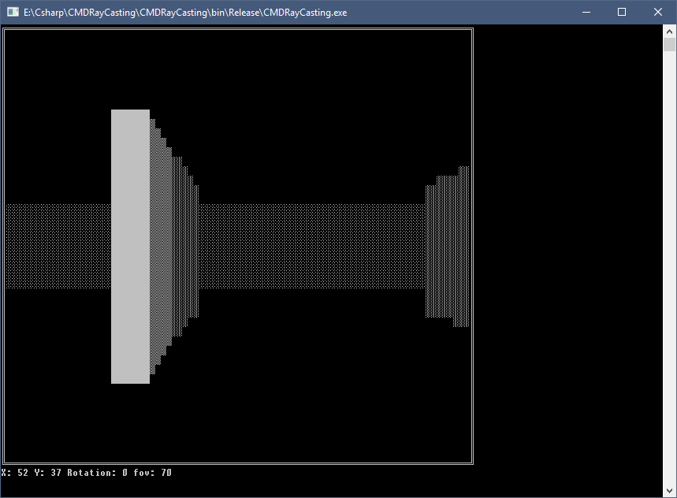
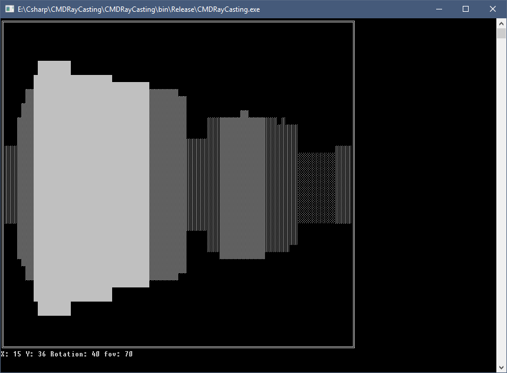
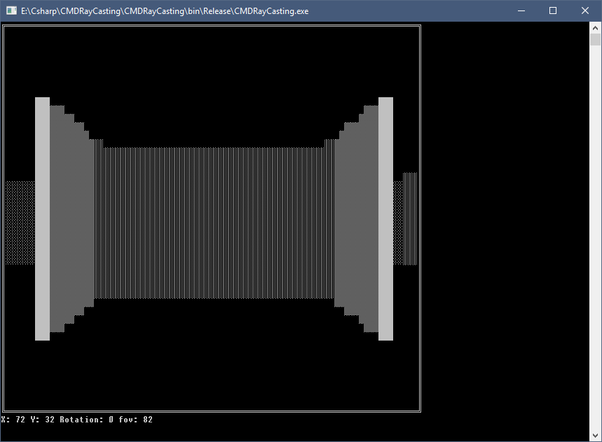

# CMDRayCasting
A simple three-dimensional game using RayCasting in a Windows console. Written in C#
### What is RayCasting?
Check it out on [Wikipedia](https://en.wikipedia.org/wiki/Ray_casting)
### Controls
* Move - W,A,S,D
* Look around - Left and Right arrow
* Change FOV - Up and Down arrow
### Screenshots

